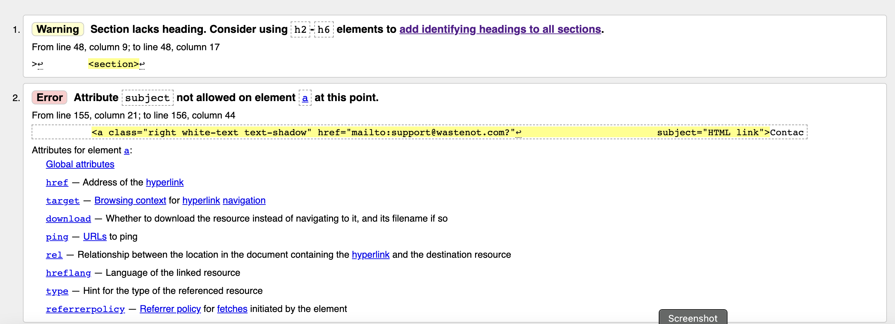
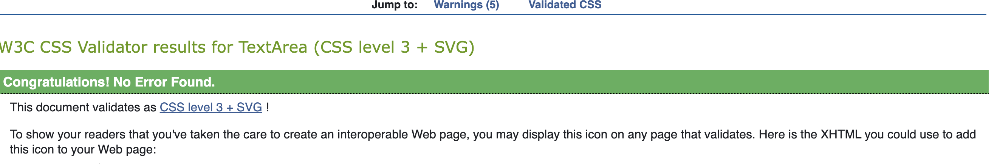
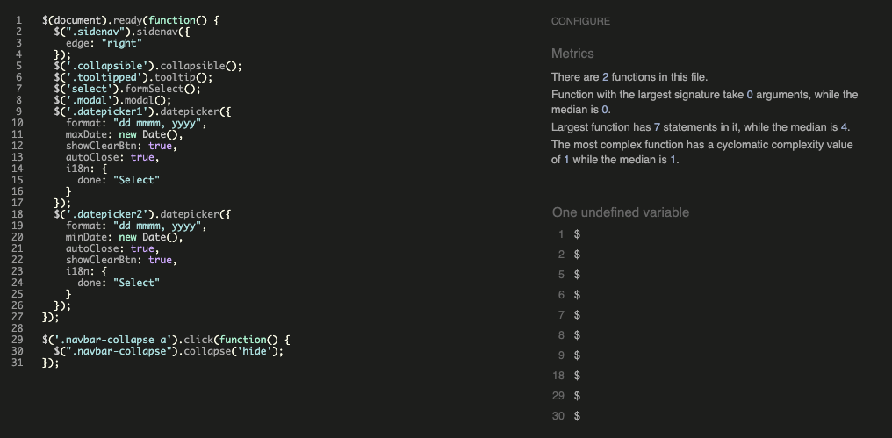
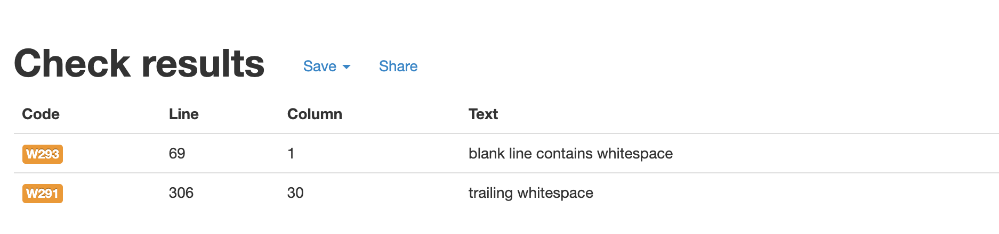
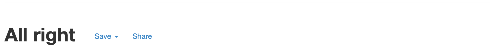
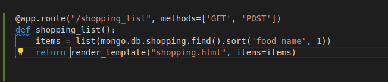

# Want Not, Waste Not - Testing document

[README.md file](/README.md)

## Table of contents
1. [Validation Testing](#validation-testing)
2. [Lighthouse Testing](#lighthouse-testing)
   * [Mobile Phone](#mobile-phone)
   * [Desktop](#desktop)
3. [Manual Testing](#manual-testing)
   * [All Pages](#all-pages)
   * [Forms](#forms)
4. [User Story Testing](#user-story-testing)
5. [Bugs](#bugs)

## Validation Testing
* [html testing with W3C Markup Validation Service](https://validator.w3.org/)
All errors attributed to the jinga code added to each page.

  * add-food.html - 2 pages of errors

    * [Image 1](docs/testing-images/html-testing-images/add-food-errors-1.png)
    * [Image 2](docs/testing-images/html-testing-images/add-food-errors-2.png)

  * add-shopping.html - 1 page of errors

    * [Image 1](docs/testing-images/html-testing-images/add-shopping-errors.png)

  * base.html - 6 pages of errors

    * [Image 1](docs/testing-images/html-testing-images/base-errors-1.png)
    * [Image 2](docs/testing-images/html-testing-images/base-errors-2.png)
    * [Image 3](docs/testing-images/html-testing-images/base-errors-3.png)
    * [Image 4](docs/testing-images/html-testing-images/base-errors-4.png)
    * [Image 5](docs/testing-images/html-testing-images/base-errors-5.png)
    * [Image 6](docs/testing-images/html-testing-images/base-errors-6.png)

  * edit-food.html - 1 page of errors
    * [Image 1](docs/testing-images/html-testing-images/edit-food-errors.png)

  * edit-shopping.html - 1 page of errors 
    * [Image 1](docs/testing-images/html-testing-images/edit-shopping-errors.png)

  * groceries.html - 3 oages if errors
    * [Image 1](docs/testing-images/html-testing-images/groceries-errors-1.png)
    * [Image 2](docs/testing-images/html-testing-images/groceries-errors-2.png)
    * [Image 3](docs/testing-images/html-testing-images/groceries-errors-3.png)

  * home.html - 1 page of errors
    * [Image 1](docs/testing-images/html-testing-images/home-errors.png)

  * profile.html - 1 page of errors
    * [Image 1](docs/testing-images/html-testing-images/profile-errors.png)

  * register.html - 2 pages of errors
    * [Image 1](docs/testing-images/html-testing-images/register-errors-1.png)
    * [Image 2](docs/testing-images/html-testing-images/register-errors-2.png)

  * shopping.html - 2 pages of errors
    * [Image 1](docs/testing-images/html-testing-images/shopping-errors-1.png)
    * [Image 2](docs/testing-images/html-testing-images/shopping-errors-2.png)

  * waste.html - 2 pages of errors
    * [Image 1](docs/testing-images/html-testing-images/waste-errors-1.png)
    * [Image 2](docs/testing-images/html-testing-images/waste-errors-2.png)

All errors listed could not be solved as errors point to jinga code within HTML which is needed to render the different pages and messages

On live deployment the following errors were found on all pages which weren't shown on testing preview pages: -



This was solved by taking the 'type="submit"' out of the a tags as this was not a button and didn't need the submit. I also changed how the section was used and this then fixed the warning about h1 to h6 tags.

* [css testing using W3C CSS Validation Service](https://jigsaw.w3.org/css-validator/)
All CSS code was put through the W3C Validation Service. The following message was shown: -


* [JsQuery testing using jshint.com](https://jshint.com/).
  
  * 

* [Pep8 Testing](http://pep8online.com/)
  *  - white spaces flagged in python code
  *  - after spaces removed

All unused variables appeared to be called when required and code was seen to be functioning as intended.

[Back to content](#table-of-contents)

## Lighthouse Testing
### Mobile phone
* 1st test
  * [home.html](docs/testing-images/lighthouse-testing/home.png) - I adjusted the contrast on the footer, and reduced image size
  * [Log In](docs/testing-images/lighthouse-testing/login-1.png)
  * [Food List](docs/testing-images/lighthouse-testing/groceries-1.png)
  * [Shopping List](docs/testing-images/lighthouse-testing/shopping-1.png)
  * [Wasted Food List](docs/testing-images/lighthouse-testing/waste-1.png)
  * [Add Food Item](docs/testing-images/lighthouse-testing/add-food-1.png)
  * [Add Shopping Item](docs/testing-images/lighthouse-testing/add-shopping-1.png)
  * [Edit Food Item](docs/testing-images/lighthouse-testing/edit-food-1.png)
  * [Edit Shopping Item](docs/testing-images/lighthouse-testing/edit-shopping-1.png)
  * [Profile Page](docs/testing-images/lighthouse-testing/profile-1.png)
  * [Registeration Page](docs/testing-images/lighthouse-testing/registeration-1.png)

I also noticed that running more than one lighthouse test on this page delivered a different set of results.

* 2nd test
  * [home.html](docs/testing-images/lighthouse-testing/home-2.png)

All other pages had scored well into the 90's with lighthouse testing
 
### Desktop
* 1st test
  * [home.html](docs/testing-images/lighthouse-testing/home-1.png)
  * [Log In](docs/testing-images/lighthouse-testing/log-in-1.png)
  * [Food List](docs/testing-images/lighthouse-testing/groceries.png)
  * [Shopping List](docs/testing-images/lighthouse-testing/shopping-list.png)
  * [Wasted Food List](docs/testing-images/lighthouse-testing/waste.png)
  * [Add Food Item](docs/testing-images/lighthouse-testing/add-food.png)
  * [Add Shopping Item](docs/testing-images/lighthouse-testing/add-shopping.png)
  * [Edit Food Item](docs/testing-images/lighthouse-testing/edit-food.png)
  * [Edit Shopping Item](docs/testing-images/lighthouse-testing/edit-shopping.png)
  * [Profile Page](docs/testing-images/lighthouse-testing/profile-desktop.png)
  * [Registeration Page](docs/testing-images/lighthouse-testing/register.png)

All the above test scores show a low score for SEO highlighting a missing meta tag. However the website does have a meta tag within the base.html

* 2nd test
A second test wasn't undertaken due to time restraints but more work would be done on the colour contrast to fix most issues that appear.

[Back to content](#table-of-contents)

## Manual Testing  

The layout of the website is as follows: -
[layout](docs/readme-images/planned-layout.pdf)

A new user must register for an account > Profile page

An existing user must log in: - 
  > Food List > Add/Edit Food Item > Move Food Item to Shopping List/Wasted Food List > Delete Food Item

  > Shopping List > Add/Edit Shopping List Item > Delete Food Item

  > Wasted Food List > Delete Food Item

  > Profile Page > Log Out > Home Page

### All Pages

**Each page contains a navigation bar at the top of the page.**
* Expectation: -  
  * A user can go directly to any part of the website by clicking the relevant page link within the navigation bar. 
  * On a mobile device, this will mean clicking the 'hamburger' icon, which will then display all the pages for a user to choose from.
* Test: - Each page link was clicked to go to the chosen page, i.e. shopping list clicked should take user to their shopping list.
* Result: - Each page link took me to the page I had clicked on. No link was broken and each page was reachable as intended.
* Verdict: - Working as intended

**Each page contained an image and 'Waste Not Want Not' text within the navigation bar in the header**
* Expectation: - The  'Waste Not Want Not' text should take a user back to the home (home.html) page
* Test: - I clicked the text on every page
* Result: -  I then directed me back to the home (home.html) page, i.e - clicking the 'Waste Not Want Not' text on the shopping list page  (shopping-list.html) directed me back to the Home (home.html) page
* Verdict: - Working as intended

**Each page also contains the following links within the navigaiton bar**
1. Food List
   * Expectation: - A user clicks the 'Food List' link and is directed to the 'Food List' content
   * Test: - Click the link and be directed to the 'Food List' content
   * Result: - I clicked this button on every page and was directed to the correct content
   * Verdict: - Working as intended

     1. Add Food Item
         * Expectation: - A user clicks the "Add Food Item" button and is directed to the "Add Food" html page to add food item
         * Test: - Clicked the button and was directed to the correct content
         * Result: - Added food item which then appeared on the Food List
         * Verdict: - Working as intended

     2. Edit Food Item
         * Expectation: - A user clicks the "Edit Food Item" button and is directed to the "Edit Food" html page to edit existing food item
         * Test: - Clicked the button and was directed to the correct content
         * Result: - Edited a food item which then appeared on the Food List
         * Verdict: - Working as intended

     3. 'Eaten' - for when user uses an item on their food list
        
         * Expectation: - A user clicks the "Eaten" button and the food item is added to their shopping list after confirmation modal is shown
         * Test: - Clicked the button and was directed to the correct content
         * Result: - Added the button and the food item then appeared on the user's shopping list (directed user to shopping.html)
         * Verdict: - Working as intended
    
     4. 'Thrown Away' - for when a user has to throw food away
        
         * Expectation: - A user clicks the "Throw Away" button and is directed to the "Wasted Food List" html page which displays food wasted
         * Test: - Clicked the button and was directed to the correct content
         * Result: - Wasted food item on wasted food list
         * Verdict: - Working as intended

     5. Delete Food Item

         * Expectation: - A user clicks the "Delete" button the food item is deleted after a warning message is shown
         * Test: - Clicked the button and food item deleted
         * Result: - Deleted food item
         * Verdict: - Working as intended

[Back to content](#table-of-contents)

2. Shopping List
   * Expectation: - A user clicks the 'Shopping List' link and is directed to the 'Shopping List' content
   * Test: - Click the link and be directed to the 'Shopping List' content
   * Result: - I clicked this button on every page and was directed to the correct content
   * Verdict: - Working as intended

     1. Add Shopping Item
        * Expectation: - A user clicks the "Add Shopping Item" button and is directed to the "Add Shopping" html page to add shopping item
        * Test: - Clicked the button and was directed to the correct content
        * Result: - Added shopping item which then appeared on the Shopping List
        * Verdict: - Working as intended

     2. Edit Shopping Item
        * Expectation: - A user clicks the "Edit Shopping Item" button and is directed to the "Edit Shopping" html page to edit existing shopping item
        * Test: - Clicked the button and was directed to the correct content
        * Result: - Edited a shopping item which then appeared on the Shopping List
        * Verdict: - Working as intended

     3. Delete Food Item
         * Expectation: - A user clicks the "Delete" button the shopping item is deleted after a warning message is shown
         * Test: - Clicked the button and shopping item deleted
         * Result: - Deleted shopping item
         * Verdict: - Working as intended

3. Wasted Food List
   * Expectation: - A user clicks the 'Wasted Food List' link and is directed to the 'Wasted Food List' content
   * Test: - Click the link and be directed to the 'Wasted Food List' content
   * Result: - I clicked this button on every page and was directed to the correct content
   * Verdict: - Working as intended

     1. Delete Wasted Food Item
         * Expectation: - A user clicks the "Delete" button the wasted item is deleted
         * Test: - Clicked the button and waste item deleted
         * Result: - Deleted waste food item
         * Verdict: - Working as intended

4. Profile Page
   * Expectation: - A user clicks the 'Profile Page' link and is directed to the 'Profile' content
   * Test: - Click the link and be directed to the 'Profile' content
   * Result: - I clicked this button on every page and was directed to the correct content
   * Verdict: - Working as intended

[Back to content](#table-of-contents)

#### Forms

There are multiple forms within the website: -

1. Register containing username and password
2. Log In containing username and password
3. Add Food Item allowing the user to enter food into their current stock list
4. Edit Food Item allowing the user to edit the food item if error made
5. Add Shopping Food Item allowing the user to add an item to their shopping list
6. Edit Shopping Food Item allowing the user to edit the item in their shopping list if error made 

**Registration Form**
1. User Name (required) - Text entered - michael
2. Password (required) - Text entered - michael01
   * Expectation: - Entering text in the right format in all fields and then pressing 'Submit' button allows the form to be submitted
   * Test: - Created an account using the username - michael and password michael01
   * Result: - I was directed to the 'profile' page once registered
   * Result: - A message was displayed on the profile page
   * Verdict: - Working as intended

**Registration Form - Incorrect/Duplicate Entry**
1. User name (required) - Entered the same username - michael
2. Password (required) - Entered the same password - michael01
   * Expectation: - Error message displayed informing user that username and/or password has already been taken
   * Test: - Filled in the same username and password as the previous registration
   * Result: - A warning message displayed informing me that username and/or password was already taken
   * Verdict: - Working as intended

**Log In Form**
1. User Name - Text entered - michael
2. Password - Text entered - michael01
   * Expectation: - Directed to my current Food/Stock List
   * Test: - Filled in form using my previously registered username and password
   * Result: - A welcome message appears on my Food/Stock List
   * Verdict: - Working as intended

**Log In Form - Incorrect Entry** 
1. User Name - Text entered - mickey
2. Password - Text entered - michael01
   * Expectation: - Error message telling user that the username and/or password is incorrect. A second messge displayed asking user to register
   * Test: - Logged in with incorrect username
   * Result: - An error message displayed telling user that name and/or password incorrect and asking user to register
   * Verdict: - Working as intended

**Add Food Item**
1. Food Name (required) - Milk entered (not entering data doens't allow submission of form)
2. Quantity (required) - 1 entered (not entering data doens't allow submission of form)
3. Price (required) - 0.99 entered (not entering data doens't allow submission of form)
4. Barcode/ID No. - 12345 entered as test
5. Purchase Date - 07/11/21 entered (current date)
6. Use by Date (required) - 10/11/21 entered (not entering data doens't allow submission of form)
   * Expectation: - Submitting form adds a food item to current stock/food list
   * Test: - Submitted the above information into the form
   * Result: - Food Item displayed on the Food/Stock List (groceries.html)
   * Verdict: - Working as intended

**Edit Food Item**
1. Food Name (required) - Milk entered
2. Quantity (required) - 5 entered (changed the quantity)
3. Price (required) - 0.99 entered
4. Barcode/ID No. - 12345 entered as test
5. Purchase Date - 07/11/21 entered (current date)
6. Use by Date (required) - 10/11/21 entered
   * Expectation: - Submitting form edits the food item selected in the current stock/food list
   * Test: - Submitted the above information into the form
   * Result: - Food Item displayed on the Food/Stock List (groceries.html) with changes made
   * Verdict: - Working as intended

**Add Shopping Food Item**
1. Food Name (required) - Bread entered (not entering data doens't allow submission of form)
2. Quantity (required) - 2 entered (not entering data doens't allow submission of form)
3. Price (required) - 1.09 entered (not entering data doens't allow submission of form)
   * Expectation: - Submitting form adds a Shopping item to current Shopping List
   * Test: - Submitted the above information into the form
   * Result: - Shopping Item displayed on the Shopping List (shopping-list.html)
   * Verdict: - Working as intended

**Edit Shopping Food Item**
1. Food Name (required) - Eggs entered - Changed from Bread entered earlier
2. Quantity (required) - 2 entered (not entering data doens't allow submission of form)
3. Price (required) - 1.09 entered (not entering data doens't allow submission of form)
   * Expectation: - Submitting form edits a Shopping item in the current Shopping List
   * Test: - Submitted the above information into the form
   * Result: - Shopping Item displayed on the Shopping List (shopping-list.html) with amendments made
   * Verdict: - Working as intended

[Back to content](#table-of-contents)

## User Story Testing

The following are the User Stories from the README.md page and the resulting Test and Result

### User Stories

As a user visiting the site for the first time:
1. I would like to be able to register for the website so I can have my personal grocery list
   * Test: - I registered for an account using username - michael, and password - michael01
   * Result: - I was directed to the profile page on the site
   * Verdict: - Success
2. I would like to easily log in once an account has been created and see my personal grocery list
   * Test: - I logged into the site from the home page with username - michael, and password - michael01
   * Result: - I was directed to the Food List page (current stock list)
   * Verdict: - Success
3. I would like to see my existing food stock displayed in an easy to understand format
   * Test: - I added a list of food items to my stock list
   * Result: - The food items were displayed in 'use by date' order
   * Verdict: - Success
4. I would like to be able to add new items to this stock list
   * Test: - I added a list of food items to my stock list
   * Result: - The food items was added to my existing stock/food list in use-by-date order
   * Verdict: - Success
5. I would like to be able to edit any items added to add/amend information created in error
   * Test: - I clicked the 'edit' button and editing an existing food item
   * Result: - The food items was sucessefully changed with the new information
   * Verdict: - Success
6. I would like to be able to delete food items no longer needed
   * Test: - I clicked the 'delete' button and a warning message was displayed to confirm deletion
   * Result: - The food items was sucessefully deleted from the food/stock list
   * Verdict: - Success
7. I would like to be able to add an item that has been eaten to my shopping list if desired. If not the item is deleted
   * Test: - I clicked the 'eaten' button and a message was displayed to confirm adding item to shopping list
   * Result: - The food item was sucessefully added to the shopping list
   * Verdict: - Success
8. I would like to be able to see what food I have wasted
   * Test: - I clicked the 'thrown away' button on a food item
   * Result: - The food item was sucessefully added to the wasted food list
   * Verdict: - Success
9. I would like to be able to see a shopping list of items I need to buy again that have been eaten
   * Test: - Click the 'shopping list' text in the navigation bar/hamburger menu 
   * Result: - The shopping list displayed items I had in my shopping list in alphabetical order
   * Verdict: - Success
10. I would like to be able to add items to this shopping list that were not on the original grocery/food list
   * Test: - I added a food item to my shopping list
   * Result: - The food items was added to my existing shopping list in alphabetical order
   * Verdict: - Success
11. I would like to be able to edit/delete items from the shopping list once ordered or no longer needed
   * Test: - I clicked the 'edit' button and editing an existing shopping item. I clicked the 'delete' button and the item was deleted after a warning message was displayed
   * Result: - The shopping item was sucessefully changed with the new information or deleted as required
   * Verdict: - Success
12. I would like to be able to see a list of food that has been wasted
   * Test: - Click the 'wasted food list' text in the navigation bar/hamburger menu
   * Result: - The wasted food list displayed items I had thrown away from my stock/food list in alphabetical order
   * Verdict: - Success
13. I would like to be able to delete food items from the wasted food list
   * Test: - I clicked the 'delete' button
   * Result: - The wasted food item was sucessefully deleted from the wasted food list
   * Verdict: - Success
14. I want to able to learn and easily understand what the website is about
   * Test: - I clicked the 'waste not want not' text. I also clicked the instructions menu within the profile page
   * Result: - Once logged in the home page displays an 'about' section. There is also more informaition in the profile page
   * Verdict: - Success
15. I want to easily understand what each section of the app does
   * Test: - To make sure that all headers, paragraphs and other content was clear and readable
   * Result: - I created the website using Materalize and the "row" and "col" tags to make the site responsive to all devices, but especially mobile
   * Verdict: - Success
16. I want to click on navigation links to be taken to the correct page/section and to be able to return to the home page or another page without using the brower forward/backward buttons
   * Test: - Each link was tested for each page, i.e. the 'shopping list' text directs me to the 'shopping list' section
   * Result: - Each link directed to the correct page
   * Verdict: - Success
17. I want these navigation links to include user friendly menus which are easy to uderstand and use
   * Test: - I tested the navigation links on a Samsung Fold 3, an iPad Pro and a MacBook Pro 2021 model
   * Result: - The navigation links worked on all devices
   * Verdict: - Success
18. I want the content to be easy to read and have a predictable layout so that each page can be navigated easily
   * Test: - I tested the website on a Samsung Fold 3, an iPad Pro and a MacBook Pro 2021 model
   * Result: - The website worked on all devices and was responsive so that all content was easily readable
   * Verdict: - Success

For the above, when designing the website I did the following to resolve the User Story desires:-

1. Created a registration section which directs new users to their profile which contains instructions, contact details and log out
2. Created a 'Log In' section on the very first page of the website so existing users do not have to find log in page
3. Created an existing food list in 'use by date' order allowing user to quickly see which items need using first
4. Created a page and a button which allows the user to add extra items to their existing food/grocery stock list
5. Created a page and a button which allows the user to be able to edit any items added to add/amend information created in error
6. Created a button which would allow the user to be able to delete food items no longer needed
7. Created a button which allows the user to add an item that has been eaten to my shopping list if desired
8. Created a html page which displays a page that shows the user the food items wasted
9. Created a html page which displays a page that shows the user a shopping list of items that the user may need to buy again
10. Created a page and a button which allows the user to add items to this shopping list that were not on the original grocery/food list
11. Created a button which will delete items from the shopping list once ordered or no longer needed
12. Created a page which displays a page that shows a list of food that has been wasted
13. Created a button that allows the user to delete food items from the wasted food list
14. Designed a home page with an 'about' section
15. Designed navigation tabs which clearly display each section link
16. Designed and impliment a navigation bar which contains links to different pages and sections in the website 
17. Designed and label the navigation bar with clear and understandable text to direct users to the correct page  
18. Designed the website to have good readability throughout

[Back to content](#table-of-contents)

## Bugs

* add-food.html

Some bugs with food not being added or page not displaying on mobile devices very well

Edited page with additional css/html to render page on mobile device.

* add-shopping.html

There was a bug with the url_for function for adding food items as this wasn't allowing me to link up the username at first. Most of this is shown below in the app.py section

* base.html

Creating the jinga templates and app.py for base.html was amended from the task mini project

* edit-food.html
```
Message sent to tutor support October 16th 2021:-

I am trying to display a form which is already filled out from a database. This form will then be edited by the user.
I am following along the mini-project for tasks on the course but adapting for my own needs.
I have created a 'add_food.html' which is working as intended but my 'edit_food.html is not working at present.
So far I am not getting pre-filled in fields in my 'edit_food.html table in my preview.
My app.py seems to be calling the correct _id number related to the item that was added but is not displaying the name, date, etc in the form that it has found.
```
> To solve the issue I needed to 'inject' the properties of the food into the respective fields - e.g. ```<p>{{ food.description }}</p>```

* edit-shopping.html

See app.py for issues relating to editing the shopping - Issues 3

* groceries.html

No issues

* home.html

No issues

* profile.html

Username wasn't displaying once user logged in but this was amended

* register.html

No issues

* shopping.html

Major issues moving items from the Food/Stock List to the Shopping List - see app.py - Issue 1
Issue seeing items moved into Shopping List when clicking the navigation link -  see app.py Issue 2

* waste.html

No issues

* app.py
  1. Error on moving item from the Stock/Food List to the Shopping List
```
@app.route("/shopping")
def shopping():
mongo.db.food.pop("food_name")
mongo.db.shopping.insert_one("food_name")
flash("You have added an item to your shopping list")
```
> I was trying to move an item from one list in my Mongdo.db collection to another collection. For example. I wanted the user to be able to click on a button which will move a food item from the food list and put it on a shopping list.
Both the food list and shopping list appear on my mongo.db database.
I tried a pop method and searched slack and asked other students too. I also tried reading and understanding the documentation in mongo website

> I tried the following: - https://www.w3schools.com/python/python_mongodb_delete.asp

``` 
I then tried the following code in my app.py: -

@app.route("/add_food", methods=["GET", "POST"])
def add_food():
if request.method == "POST":
short_date = "on" if request.form.get("short_date") else "off"
food = {
"location": request.form.get("location"),
"food_name": request.form.get("food_name"),
"barcode": request.form.get("barcode"),
"purchase_date": request.form.get("purchase_date"),
"use_by_date": request.form.get("use_by_date"),
"short_date": short_date,
"created_by": session["user"]
}
mongo.db.food.insert_one(food)
flash("Food added succesfully")
return redirect(url_for("modifies"))
foods = mongo.db.food.find().sort("food_name", 1)
return render_template("add_food.html", foods=foods)
```
> Tutor support helped me to rewrite this to: - 
```
<a href="/add_to_list/{{ item_id }}"
@app.route('/add_to_list/<item_id>/)
def add_to_list(item_id):
# get the item by id from the first collection
# copy the item as a dictionary
# delete the id from the copy
# delete the item from the first list
# insert the copy into the second list
```
```
I then created new code to move the food item to the shopping list: -

@app.route("/shopping/<food_name>", methods=['GET', 'POST'])
def shopping(food_name):
# get the item by id from the first collection
print(food_name)
food = mongo.db.food.find_one(
{"food_name": "food_name"})
print(food)
return render_template("modifies.html")
```
> I then had some issues with testing that meant that I would get the following [error message](docs/testing-images/move-error.jpg)
```
The final working code with help from my mentor was: -

@app.route("/shopping/<food_name>", methods=['GET', 'POST'])
def shopping(food_name):
    """
    Moves selected food item from the food list collection to the shopping list
    Displays success message to user
    """
    food = mongo.db.food.find_one({"food_name": food_name})
    if food:
        new_shopping_item = {
            "food_name": food.get('food_name'),
            "quantity": food.get('quantity'),
            "price": food.get('price'),
            "created_by": session['user']
        }
        print(food.get("created_by"))
        mongo.db.shopping.insert_one(new_shopping_item)
        mongo.db.food.remove({"food_name": food_name})
        flash("Food Item added to Shopping List")

    items = mongo.db.shopping.find().sort('food_name', 1)
    return render_template("shopping.html", items=items)
```
[Back to content](#table-of-contents)

  2. Error on listing items in Shopping List after user had moved them or added them
```
Message sent to tutor support

So my base.html has a nav link which is this: -
{{ url_for('shopping', username=session['user']) }}
However, I keep getting errors on the username part. I want the page to display for the current user so copied the code from one of the nav links above.
```
> The main issue was that I was getting a jinga message telling me that 'user' could not be found. A secondary issue was that I had a function which added an itme to the Shopping List from the original stock/food list which was working.
```
In the groceries.html there is a button 'Eaten'.
Clicking the "eaten' button then adds this item to the shopping list and deletes from the food list.
I am hoping to then be able to show the shopping list to the user from the nav link when they are logged in.
At the moment, I can delete an item from the food item list, it then does display a html page showing a shopping list but I can't access this page from the nav bar.
```
> I was trying to add a navigation and a function at the same time. With tutor support I created a separate function for the navigation. The navigation bar now links to the following function 

[Back to content](#table-of-contents)

  3. Clicking the edit shopping item on the shopping.html brings up the edit_shopping.html page and also shows the data to be edited.
However, changing any of the items has no effect on the database when submitting the form.
 ```
edit_shopping.html 

<form class="col s12" method="POST" action="{{ url_for('edit_shopping', food_name=shopping._id) }}">
```
```
app.py

@app.route("/edit_shopping/<food_name>", methods=["GET", "POST"])
def edit_shopping(food_name):
# Allows user to change food details if error in list
if request.method == "POST":
submit = {
"food_name": request.form.get("food_name"),
"created_by": session["user"]
}
mongo.db.shopping.update({"_id": ObjectId(food_name)}, submit)
flash("Shopping List Item Updated Succesfully")
return redirect(url_for("shopping"))
food = mongo.db.shopping.find_one({"_id": ObjectId(food_name)})
foods = mongo.db.shopping.find().sort("food_name", 1)
return render_template("edit_shopping.html", food=food, foods=foods)
```
However I seemed to get errors with each fix. 
[Image 1](docs/testing-images/shopping-error.png)
[Image 2](docs/testing-images/shopping-error-2.png)
[Image 3](docs/testing-images/shopping-food-name-error.png)

> This was finally fixed by using the following code with help from tutors
```
@app.route("/edit_shopping/<food_name>", methods=["GET", "POST"])
def edit_shopping(food_name):
    """
    Allows user to change shopping list item details if error in list
    Displays message to user
    """
    if request.method == "POST":
        submit = {
            "food_name": request.form.get("food_name"),
            "quantity": request.form.get("quantity"),
            "price": request.form.get("price"),
            "created_by": session["user"]
        }
        mongo.db.shopping.update({"_id": ObjectId(food_name)}, submit)
        flash("Shopping List Item Updated Succesfully")
        return redirect(url_for("shopping_list"))

    shopping = mongo.db.shopping.find_one({"_id": ObjectId(food_name)})
    return render_template("edit-shopping.html", shopping=shopping)
```
* other

All other issues were minor bugs such as mistyped words, missing '{}' around template code and passing the wrong variable within the app.py or url_for jinga links

[Back to content](#table-of-contents)